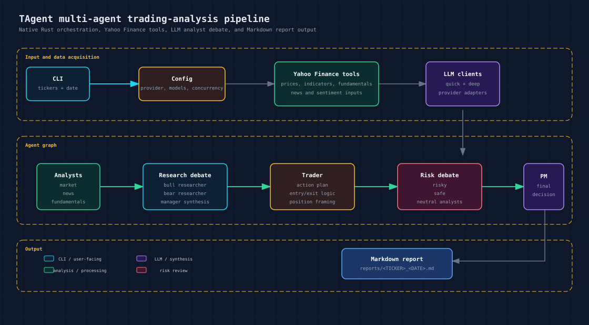

# TAgent

TAgent is a Rust trading-analysis agent that turns one or more tickers into Markdown reports using market data, fundamentals, news, multi-agent debate, and LLM synthesis.

It is a Rust rebuild inspired by [TauricResearch/TradingAgents](https://github.com/TauricResearch/TradingAgents). The goal is not to be a line-by-line port; TAgent keeps the TradingAgents-style analyst/debate/trader/risk/portfolio-manager flow while optimizing for native execution, lower orchestration overhead, controlled batch concurrency, and simple single-binary operation.

> This project is for research and education only. It is not financial advice, investment advice, or a recommendation to buy, sell, or hold any security.
>
> TAgent is inspired by [TauricResearch/TradingAgents](https://github.com/TauricResearch/TradingAgents), which is licensed under Apache-2.0.

## Why TAgent

- **Rust-first runtime:** no Python runtime is required for normal CLI use.
- **Native data acquisition:** market data, technical indicators, fundamentals, and news are fetched through Rust HTTP calls to Yahoo Finance public endpoints.
- **TradingAgents-style reasoning:** analyst reports feed bull/bear research, trader planning, risk debate, and portfolio-manager synthesis.
- **Batch-friendly execution:** ticker validation and multi-ticker analysis use async Rust with configurable concurrency.
- **Provider flexibility:** MiniMax, Z.ai, OpenAI-compatible, and Anthropic-compatible providers are supported through a shared LLM client abstraction.
- **File-based output:** generated reports are saved under `reports/` by default for easy review and archiving.

## Pipeline

<p align="center">
  
</p>

TAgent runs a fixed research pipeline:

1. Market, sentiment, news, and fundamentals analysts gather evidence through Yahoo Finance tools.
2. Bull and bear researchers debate the investment case.
3. A research manager synthesizes the debate into an investment plan.
4. A trader converts the plan into concrete trading logic.
5. Risk analysts debate risky, safe, and neutral interpretations.
6. A portfolio manager writes the final decision and report.

## Quick start

### Prerequisites

- Rust 1.80 or newer with Cargo
- An API key for one supported LLM provider

### Setup

```powershell
git clone <repo-url>
cd tagent

Copy-Item .env.example .env
```

Edit `.env` and set the provider plus API key you want to use. The default provider is MiniMax:

```dotenv
TAGENT_PROVIDER=minimax
MINIMAX_API_KEY=your-key-here
```

Build and run local checks:

```powershell
cargo test
cargo build --release
```

After a release build, the Windows binary is at `target\release\tagent.exe`.

## CLI usage

Show help without requiring an API key:

```powershell
cargo run -- --help
```

Validate configuration without running market analysis:

```powershell
cargo run -- config check
```

List supported providers:

```powershell
cargo run -- providers
```

Run one ticker for today's local date:

```powershell
cargo run -- AAPL
```

Run one ticker for an explicit date:

```powershell
cargo run -- AAPL --date 2026-04-30
```

Run multiple tickers with controlled batch concurrency:

```powershell
cargo run -- analyze AAPL MSFT NVDA --date 2026-04-30 --concurrency 2
```

Legacy positional date syntax is still supported:

```powershell
cargo run -- AAPL MSFT NVDA 2026-04-30
```

Generated reports are written to `reports\<TICKER>_<DATE>.md` unless `--reports-dir` or `TAGENT_REPORTS_DIR` overrides the directory.

## Configuration

TAgent loads `.env` automatically. Generic `TAGENT_*` variables override provider-specific values, and CLI flags override environment variables for a single run.

| Variable | CLI flag | Description | Default |
| --- | --- | --- | --- |
| `TAGENT_PROVIDER` | `--provider` | `minimax`, `zai`, `openai`, or `anthropic` | `minimax` |
| `TAGENT_API_KEY` | unset | Generic API key override | unset |
| `TAGENT_BASE_URL` | unset | Generic base URL override | provider default |
| `TAGENT_MODEL` | `--model` | Generic model override for both quick and deep calls | provider default |
| `TAGENT_QUICK_MODEL` | `--quick-model` | Model for analyst/tool-heavy calls | `TAGENT_MODEL` |
| `TAGENT_DEEP_MODEL` | `--deep-model` | Model for synthesis calls | `TAGENT_MODEL` |
| `TAGENT_BATCH_CONCURRENCY` | `--concurrency` | Number of ticker analyses to run concurrently in batch mode | `1` |
| `TAGENT_REPORTS_DIR` | `--reports-dir` | Directory for generated Markdown reports | `reports` |
| `TAGENT_YAHOO_BASE_URL` | unset | Optional Yahoo Finance base URL override | `https://query1.finance.yahoo.com` |

Provider-specific variables:

| Provider | API key | Base URL | Default model |
| --- | --- | --- | --- |
| MiniMax | `MINIMAX_API_KEY` | `MINIMAX_BASE_URL` | `MiniMax-M2.7` |
| Z.ai | `ZAI_API_KEY` | `ZAI_BASE_URL` | `GLM-5.1` |
| OpenAI | `OPENAI_API_KEY` | `OPENAI_BASE_URL` | `gpt-4o` |
| Anthropic | `ANTHROPIC_API_KEY` | `ANTHROPIC_BASE_URL` | `claude-sonnet-4-6` |

For rate-limit-sensitive providers, keep `TAGENT_BATCH_CONCURRENCY=1` or pass `--concurrency 1`.

## Output example

A generated report is a Markdown file with a final portfolio-manager decision. The exact wording depends on market data and the selected model, but the shape is:

```markdown
# AAPL Analysis - 2026-04-30

> For research and education only. Not financial advice, investment advice, or a recommendation to buy, sell, or hold any security.

**Completed in 84s**

## Final Decision

Action: HOLD
Confidence: Moderate

Rationale:
- Technical momentum is mixed while recent news does not justify an aggressive entry.
- Fundamentals remain resilient, but valuation leaves limited margin of safety.
- Risk review favors waiting for a clearer catalyst or improved entry price.

Risk Controls:
- Re-evaluate if price breaks key support or volume confirms a trend reversal.
- Avoid oversized exposure while macro and earnings uncertainty remain elevated.
```

See [examples/mock-report.md](examples/mock-report.md) for a longer mock report.

## Current limitations and roadmap

TAgent intentionally starts smaller than the upstream Python project. The current focus is a fast, native CLI workflow. Important gaps are tracked as future work:

| Area | Current status | Target direction |
| --- | --- | --- |
| Interactive CLI | Non-interactive CLI with `clap` help and subcommands | Add richer guided prompts if demand is clear |
| Docker | Not packaged yet | Add `Dockerfile` and compose examples |
| Local models | Not wired to Ollama yet | Add an Ollama/OpenAI-compatible local profile |
| Provider coverage | MiniMax, Z.ai, OpenAI-compatible, Anthropic-compatible | Consider Gemini, DeepSeek, Qwen, OpenRouter, Azure, and Bedrock |
| Persistence | BM25 memory utilities exist, but runtime persistence is not enabled | Wire persistent decision memory and document its storage path |
| Checkpoint resume | Not implemented | Add resumable graph execution for interrupted long runs |
| Benchmarks | Performance goal is documented, but benchmark results are not published | Add repeatable multi-ticker benchmark scripts and results |

## Development

```powershell
cargo fmt --check
cargo clippy --all-targets -- -D warnings
cargo test
```

GitHub Actions CI runs these checks on every push and pull request.

Yahoo Finance data is fetched natively from Rust; no Python runtime is required for normal use. Yahoo Finance endpoints are public and can change or rate-limit, so live data tests should be treated as smoke tests rather than deterministic unit tests.

## Project docs

- [Contributing guide](CONTRIBUTING.md)
- [Architecture notes](docs/ARCHITECTURE.md)
- [Development guide](docs/DEVELOPMENT.md)
- [Security policy](SECURITY.md)
- [Release guide](docs/RELEASE.md)
- [Mock report example](examples/mock-report.md)

## License and attribution

TAgent is licensed under the Apache License, Version 2.0. See [LICENSE](LICENSE).

This project is a Rust rebuild inspired by [TauricResearch/TradingAgents](https://github.com/TauricResearch/TradingAgents), which is also licensed under Apache-2.0. See [NOTICE](NOTICE).
